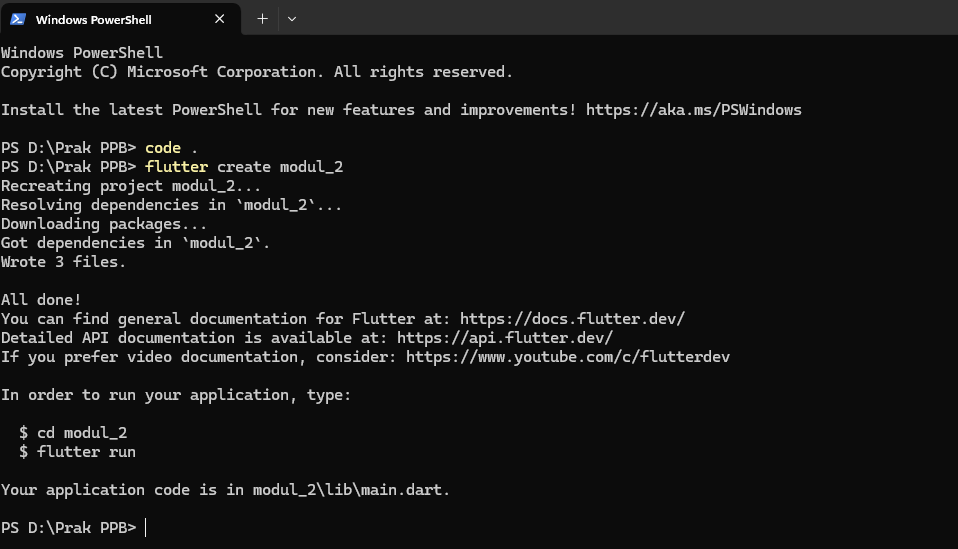
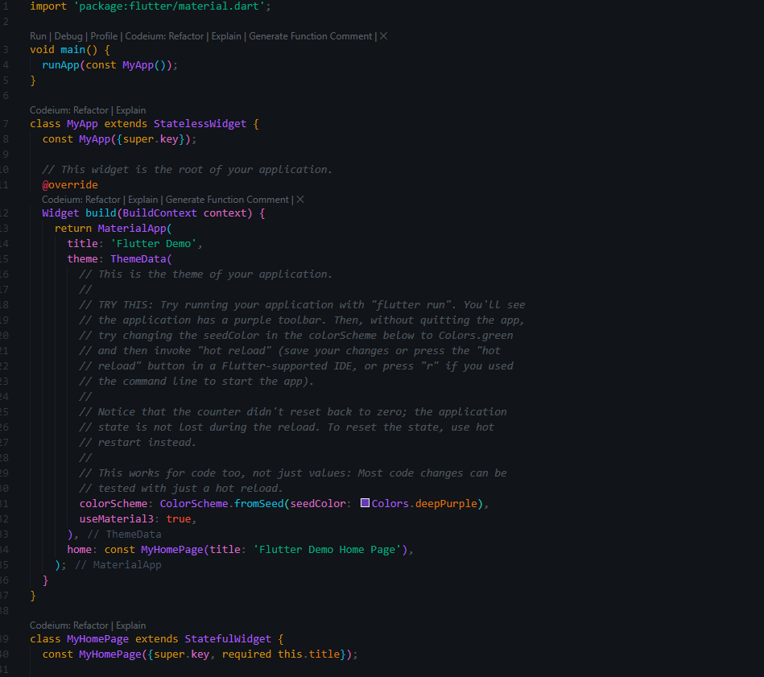
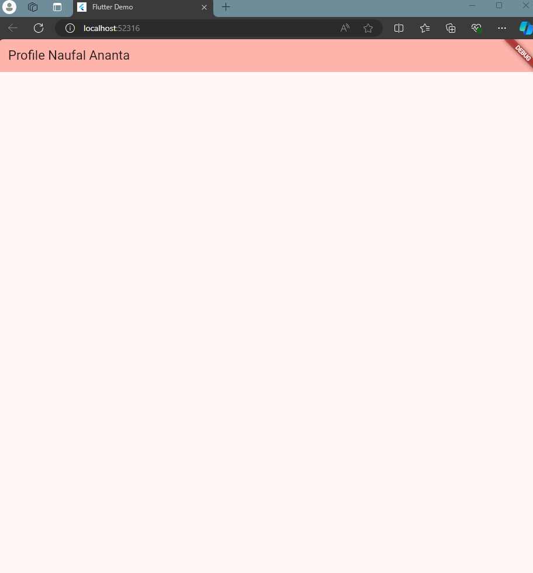
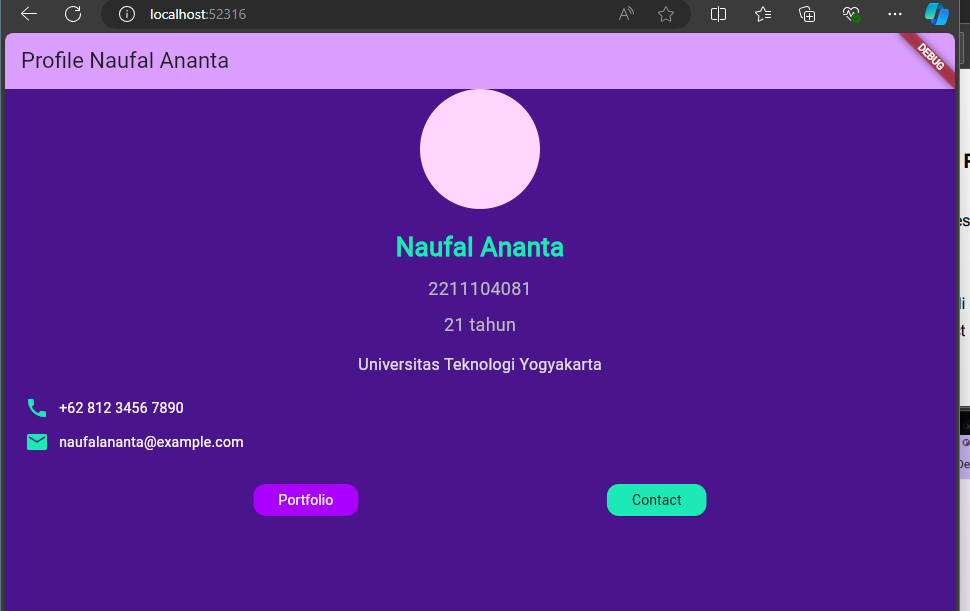

# PPB_NAUFAL ANANTA_2211104081_SE-06-C/01_Running-Modul/LP_01

<li> Nama   : Naufal Ananta
<li> NIM    : 2211104081
<li> Kelas  : SE-06-02

## 1. Jelaskan apa itu Dart & Flutter beserta contoh widget yang ada pada Flutter

<li> Dart adalah sebuah bahasa pemrograman yang dikembangkan oleh Google. Bahasa ini dirancang untuk menjadi sederhana, cepat, dan mudah dipelajari. Dart seringkali diibaratkan sebagai perpaduan antara JavaScript dan Java, menawarkan fitur-fitur yang baik dari kedua bahasa tersebut.</li>
<li>Flutter adalah sebuah UI toolkit yang juga dikembangkan oleh Google. Flutter memungkinkan pengembang untuk membangun aplikasi mobile, web, dan desktop dari satu basis kode. Flutter menggunakan Dart sebagai bahasa pemrograman utamanya.</li>

## Contoh Widget di Flutter
Flutter memiliki banyak sekali jenis widget. Berikut beberapa contoh widget yang sering digunakan:

  <li>StatelessWidget: Widget yang tidak memiliki state internal. Contoh: Text, Icon, Image.</li>
  <li>StatefulWidget: Widget yang memiliki state internal dan dapat berubah seiring waktu. Contoh: TextFormField, Checkbox, DropdownButton.</li>
  <li>Layout Widget: Widget yang digunakan untuk mengatur tata letak elemen di layar. Contoh: Row, Column, Stack, Container.</li>
  <li>Material Widget: Widget yang mengikuti Material Design dari Google. Contoh: AppBar, Scaffold, Card.</li>
  <li>Cupertino Widget: Widget yang mengikuti desain iOS. Contoh: CupertinoNavigationBar, CupertinoButton.</li>

   
  
## 2. Buatlah sebuah project Flutter

 

 

## 3. Setelah project dibuat, jalankan di emulator atau pada real device (jika pada tampilan telah keluar project Flutter seperti gambar di bawah, maka telah berhasil).

 

## 4. Setelah berhasil, modifikasi halaman diatas untuk menampilkan biodata kalian, minimal 5 widget!! (bebas, buatlah sekreatif mungkin).

